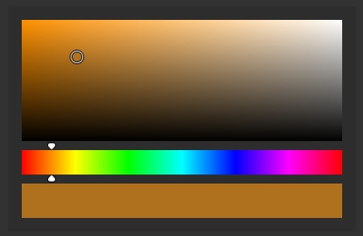

# Preview

<p align="center">
  
</p>

# API

Initialization:
```lua
ColorPicker.new(color, alpha, width, height [, margins])
```
* color (number) - background color of container
* alpha (number) - background alpha of container
* width (number) - width of color picker gradient
* height (number) - height of color picker gradient
* margins (number, optional, default = 0) - innter margin

Getting selected color value:
```lua
local colorPicker = ColorPicker.new(0, 0.1, 128, 128, 15)
print(colorPicker:getSelectedColor())
```

Resize container:
```lua
local colorPicker = ColorPicker.new(0, 0.1, 128, 128, 15)
colorPicker:setDimension(150, 330)
```
